# Final Project - Software Engineering V

## Automating and Deploying a Microservices Project Lifecycle

### Authors:

* Alejandro Córdoba Erazo
* Alejandro Londoño Bermúdez

---

## 🧠 Context

In this project, we aimed to automate and monitor the lifecycle of a microservices-based software project. This included setting up proper development practices, continuous integration and delivery, security scanning, testing, code quality enforcement, and monitoring.

---

## 🧠 Infrastructure Overview

### Kubernetes Manifests

This project uses Kubernetes manifests to define and deploy microservices in a structured and environment-agnostic manner. The base configurations are reusable across multiple environments, such as `stage` and `prod`, to ensure consistency and portability.

* **Structure**: Microservices are organized with a clear separation of concerns.
* **Environment Flexibility**: Core manifests are designed to be environment-agnostic, with environment-specific overlays or values applied as needed.

### DevOps Environment

The DevOps environment integrates monitoring and security tools to support the full lifecycle of the platform. This environment ensures automation, reproducibility, and compliance across deployments.

* **Security**: Integration with secret management and image scanning tools.
* **Observability**: Includes support for metrics, and alerting.

---

## 🛠️ Terraform Infrastructure

Infrastructure provisioning is handled using Terraform, following modular design principles to ensure scalability, reusability, and maintainability.

### Design Pattern: Modular Architecture

The Terraform codebase is structured using a **modular design pattern**, which encapsulates reusable components and enforces best practices in infrastructure provisioning.

* **Reusability**: Modules are self-contained and can be reused across environments and projects.
* **Maintainability**: Each module has a clear input/output interface and documentation.
* **Scalability**: New components can be added with minimal duplication or refactoring.

---

### Terraform Module: `aks-cluster`

This module provisions an Azure Kubernetes Service (AKS) cluster with configurable parameters to support diverse deployment scenarios.

**Key Features:**

* Configurable node pools (VM size, autoscaling, taints, etc.)

---

## 🔧 Static Code Analysis

To ensure code quality and detect code smells, vulnerabilities, and bugs early, we integrated **SonarQube** as part of our CI pipeline.

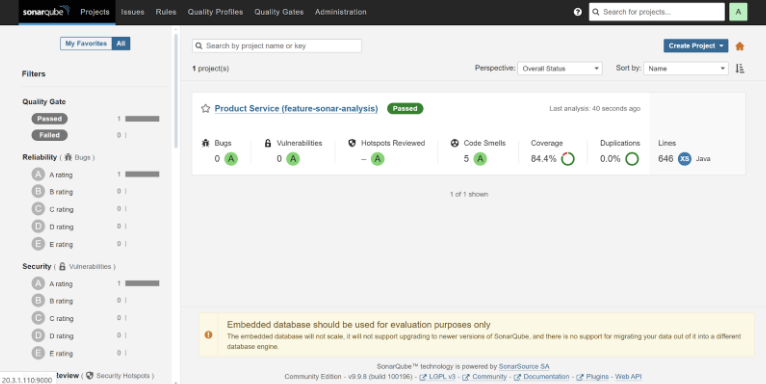

---

## 🧪 Testing and Code Coverage

Every pull request triggered automated test runs. We maintained a **code coverage of at least 80%** in all services using **JaCoCo**.

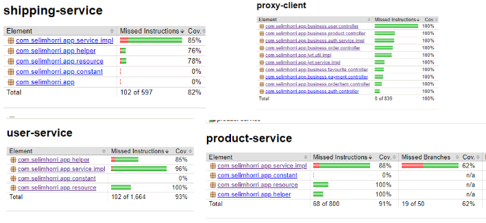
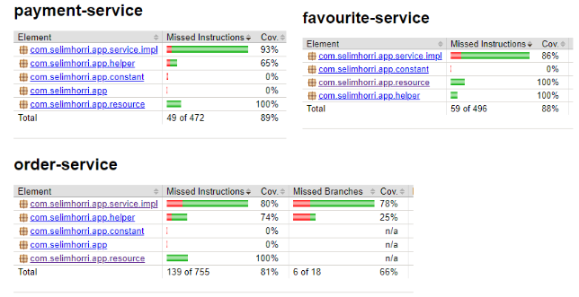

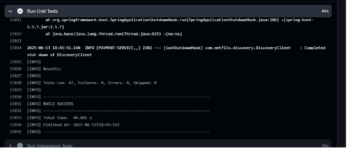

---

## 🔐 Security Scanning

We used **Trivy** to scan for vulnerabilities in our Docker images as part of the build process.

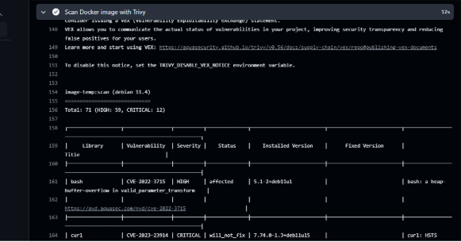

---

## 📊 Monitoring and Observability

We implemented monitoring using **Prometheus** and **Grafana** to track system metrics and health in real time.

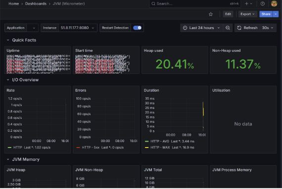
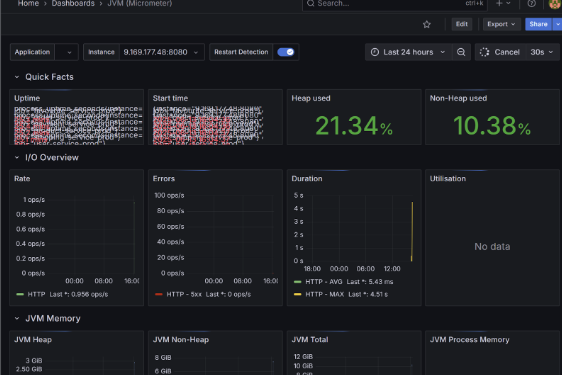
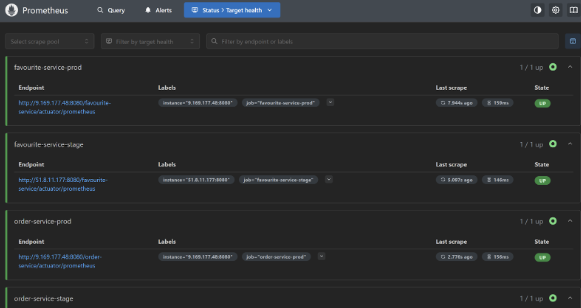

---

## 🛠 CI/CD Pipeline

We set up CI/CD pipelines to automate builds, tests, analysis, and deployments. Notifications were sent upon pipeline executions.

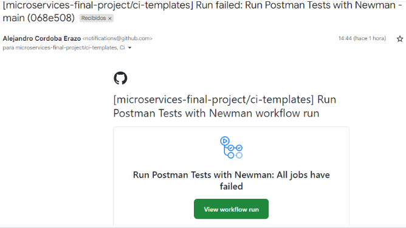

Each PR to `develop` or `stage` branch triggered automated workflows.

---

## 🏗 Architecture

We started with a predefined architecture and proposed an improved version based on Kubernetes for better scalability and management.

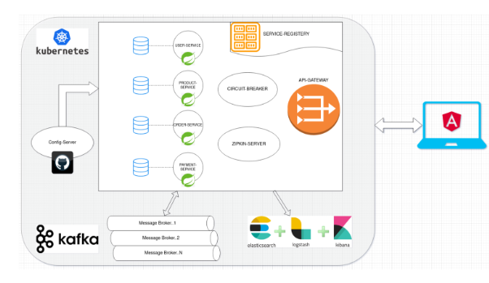

**Our proposed Kubernetes-based architecture:**

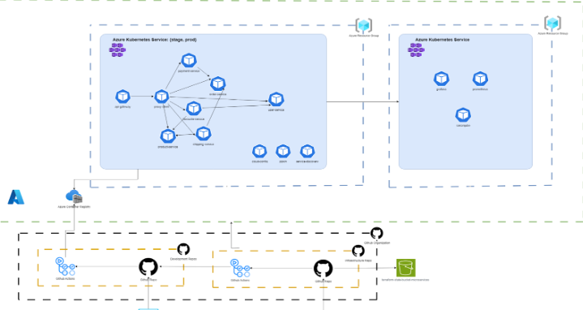

---

## 📈 Outcomes

* Integrated DevOps pipeline with analysis, testing, security, and monitoring.
* Achieved high test coverage (80%+).
* Improved observability using Grafana and Prometheus.
* Applied software design patterns such as Circuit Breaker, Throttling, and External Config.

---

## 📚 Lessons Learned

* Automating the software lifecycle greatly increases confidence and deployment frequency.
* Code quality tools and monitoring are essential for scalable systems.

---

## 🙌 Thanks for reading!
